# AI-Driven Proctored Exam Platform
### Gautam Buddha University, Noida — Implementation Plan

> A production-grade, AI-powered online examination platform with real-time proctoring, face identity verification, behavioral monitoring, and multi-role dashboards. Built entirely on open-source tools, spun up with a single `docker compose up` command.

---

## High-Level Architecture

```mermaid
graph TD
    SB["🎓 Student Browser"]
    PB["👮 Proctor Browser"]
    AB["🛠 Admin Browser"]
    Nginx["Nginx (Reverse Proxy :80)"]
    React["React Frontend (Vite)"]
    Spring["Spring Boot Backend (:8080)"]
    AI["Python AI Service (FastAPI :8000)"]
    PG["PostgreSQL :5432"]
    Redis["Redis :6379"]
    MQ["RabbitMQ :5672"]
    Minio["MinIO :9000"]

    SB & PB & AB -->|HTTPS| Nginx
    Nginx -->|/| React
    Nginx -->|/api/* /ws/*| Spring
    Spring <-->|REST calls for identity check / on-demand analysis| AI
    Spring -->|Publish frames, audio, events| MQ
    MQ -->|Consume queues| AI
    AI -->|Write proctoring events| PG
    AI -->|Publish results| MQ
    MQ -->|Consume results| Spring
    Spring -->|WebSocket push alerts| PB
    Spring <--> PG
    Spring <--> Redis
    Spring <--> Minio
    AI <--> Minio
```



---

## Service Interaction Reference

### How Every Service Talks to Each Other

| From | To | Protocol | What / When |
|---|---|---|---|
| React (student) | Nginx → Spring | HTTPS REST | Login, fetch exam, submit answers |
| React (student) | Nginx → Spring | WSS (STOMP) | Stream camera frames, send behavior events, receive warnings |
| React (proctor) | Nginx → Spring | HTTPS REST | Fetch session list, event logs |
| React (proctor) | Nginx → Spring | WSS (STOMP) | Receive real-time violation alerts |
| Spring | PostgreSQL | JDBC/JPA | All persistent reads/writes |
| Spring | Redis | Lettuce | JWT blacklist, active session presence, rate limiting |
| Spring | MinIO | HTTP (SDK) | Store/retrieve profile photos, violation snapshots |
| Spring | RabbitMQ | AMQP | Publish `frame.analysis`, `audio.analysis`, `behavior.events` |
| Spring | AI Service | HTTP REST | Identity check at login (synchronous, needs immediate response) |
| RabbitMQ | AI Service | AMQP | Deliver queued frames/audio for async processing |
| AI Service | PostgreSQL | SQLAlchemy | Write `proctoring_events` rows directly |
| AI Service | MinIO | HTTP (SDK) | Save violation snapshots |
| AI Service | RabbitMQ | AMQP | Publish `proctoring.results` back to Spring |
| Spring | Proctor WebSocket | STOMP/WS | Push alerts to proctor dashboard in real time |

### Frame Processing Pipeline (Critical Path)

```
[Student Browser]
  setInterval(2000) → capture webcam frame → compress to JPEG → Base64 encode
  → send via WebSocket: /app/exam/{sessionId}/frame

[Spring Boot - WebSocketFrameHandler]
  → authenticate session token
  → decode Base64 → save to MinIO only if previous risk was HIGH
  → build FrameMessage(sessionId, frameBytes, timestamp)
  → publish to RabbitMQ: exchange=proctoring, routingKey=frame.analysis

[Python AI Service - FrameConsumer]
  → decode JPEG bytes → numpy array
  → FaceMonitor.analyze(frame) → {face_count, face_present, face_bbox}
  → GazeTracker.analyze(frame) → {gaze_direction, head_yaw, head_pitch, eyes_closed}
  → MouthMonitor.analyze(frame) → {mouth_open, lip_distance_ratio}
  → ObjectDetector.analyze(frame) → [{label, confidence, bbox}]
  → RiskAggregator.score(all_results) → {final_risk_score, violations[]}
  → write row to proctoring_events table (via SQLAlchemy)
  → publish to RabbitMQ: exchange=proctoring, routingKey=proctoring.results

[Spring Boot - ResultConsumer]
  → read ProctoringResult message
  → update violations_summary for the session
  → if risk_score > 0.75: push WebSocket alert to /topic/proctor/alerts
  → if risk_score > 0.90: auto-suspend session (flag for immediate proctor review)
```

### Audio Pipeline

```
[Student Browser]
  MediaRecorder (audio/webm) → every 10 seconds → Base64 blob
  → WebSocket: /app/exam/{sessionId}/audio

[Spring Boot]
  → decode → store in MinIO (audio-clips bucket)
  → publish to RabbitMQ: audio.analysis queue

[Python AI - AudioConsumer]
  → decode WebM → convert to PCM via soundfile/pydub
  → webrtcvad.process(pcm_frames) → speech_segments[]
  → if speech_detected: alert type=AUDIO_VIOLATION, severity=HIGH
  → publish result
```

### Behavior Event Pipeline

```
[Student Browser - JS Event Listeners]
  visibilitychange / blur / focus / keydown / contextmenu / copy / paste / fullscreenchange
  → collect event → send via WebSocket: /app/exam/{sessionId}/event
  → payload: {type: "TAB_SWITCH", timestamp, metadata}

[Spring Boot - BehaviorEventHandler]
  → validate → write to behavior_events table immediately
  → publish to RabbitMQ: behavior.events
  → rule-based quick check: if TAB_SWITCH count > 3 in session → immediate warning push

[Python AI - BehaviorConsumer]
  → accumulate events per session in time window
  → feed features to XGBoost classifier → behavior_risk_score
  → publish result back to Spring
```

---

## Complete Technology Stack

### Spring Boot Backend

| Library | Maven Artifact | Purpose |
|---|---|---|
| Spring Web | `spring-boot-starter-web` | REST controllers |
| Spring Security | `spring-boot-starter-security` | Auth filter chain, role guards |
| Spring Data JPA | `spring-boot-starter-data-jpa` | ORM, repositories |
| Spring WebSocket | `spring-boot-starter-websocket` | STOMP WebSocket server |
| Spring AMQP | `spring-boot-starter-amqp` | RabbitMQ publisher/consumer |
| Spring Data Redis | `spring-boot-starter-data-redis` | Session cache, JWT blacklist |
| Spring Mail | `spring-boot-starter-mail` | Email notifications |
| Spring Scheduler | `@EnableScheduling` built-in | Cron jobs (auto-end exams, cleanup) |
| Spring Validation | `spring-boot-starter-validation` | Bean Validation on DTOs |
| Spring Actuator | `spring-boot-starter-actuator` | Health checks, metrics |
| JWT | `jjwt-api`, `jjwt-impl`, `jjwt-jackson` | Access + refresh tokens |
| Flyway | `flyway-core` | Versioned DB migrations |
| MinIO SDK | `minio` | Object storage client |
| Lombok | `lombok` | Boilerplate reduction |
| MapStruct | `mapstruct`, `mapstruct-processor` | DTO ↔ Entity mapping |
| PostgreSQL | `postgresql` | JDBC driver |
| Jackson | `jackson-databind` (auto) | JSON serialization |
| OpenCSV | `opencsv` | CSV export for admin reports |
| SpringDoc | `springdoc-openapi-starter-webmvc-ui` | Swagger UI at `/swagger-ui.html` |
| Testcontainers | `testcontainers` | Integration testing with real DB |
| JUnit 5 | `spring-boot-starter-test` | Unit/integration tests |

### Python AI Service

| Library | Purpose |
|---|---|
| `fastapi` | REST API framework |
| `uvicorn` | ASGI server |
| `opencv-python-headless` | Frame decoding, image ops |
| `mediapipe` | Face mesh, iris, pose |
| `face-recognition` | Face embedding + match (wraps dlib) |
| `ultralytics` (YOLOv8) | Phone/book/person detection |
| `webrtcvad` | Voice Activity Detection |
| `pydub` + `soundfile` | Audio format conversion |
| `scikit-learn` | Preprocessing, LabelEncoder |
| `xgboost` | Risk classification model |
| `numpy` | Numerical computation |
| `Pillow` | Image encode/decode |
| `pika` | RabbitMQ AMQP consumer |
| `sqlalchemy` | Write events to PostgreSQL |
| `psycopg2-binary` | PostgreSQL driver |
| `minio` | MinIO SDK for Python |
| `joblib` | Load trained model pickle |
| `python-multipart` | Multipart file handling |

### React Frontend (Vite)

| Library | Purpose |
|---|---|
| `react` + `react-dom` | Core UI |
| `vite` | Fast build + dev server |
| `react-router-dom` v6 | Client-side routing |
| `zustand` | Global state (auth, exam, alerts) |
| `axios` | HTTP client with interceptors |
| `@stomp/stompjs` + `sockjs-client` | WebSocket STOMP client |
| `react-webcam` | Declarative webcam access |
| `recharts` | Charts (risk timeline, session stats) |
| `react-hook-form` + `zod` | Form handling + validation |
| `react-hot-toast` | Toast alerts |
| `react-countdown` | Exam timer |
| `lucide-react` | Icon set |
| `tailwindcss` | Utility-first CSS |
| `@tanstack/react-query` | Server state, caching API responses |
| `date-fns` | Date/time formatting |

---

## Complete Spring Boot Backend Design

### Package Structure

```
com.gbu.examplatform/
├── config/
│   ├── SecurityConfig.java          # JWT filter chain, CORS, role permitAll rules
│   ├── WebSocketConfig.java         # STOMP endpoint config, message broker
│   ├── RabbitMQConfig.java          # Exchanges, queues, bindings declarations
│   ├── RedisConfig.java             # RedisTemplate, connection factory
│   ├── MinioConfig.java             # MinioClient bean, bucket init
│   ├── FlywayConfig.java            # Migration scripts ordering
│   └── SwaggerConfig.java           # OpenAPI metadata
│
├── security/
│   ├── JwtTokenProvider.java        # generate, validate, extract claims from JWT
│   ├── JwtAuthenticationFilter.java # OncePerRequestFilter, reads Bearer token
│   ├── CustomUserDetailsService.java# loadUserByUsername from DB
│   └── SecurityUtils.java           # get current authenticated user helper
│
├── modules/
│   ├── auth/
│   │   ├── AuthController.java      # /api/auth/*
│   │   ├── AuthService.java
│   │   ├── dto/                     # LoginRequest, RegisterRequest, TokenResponse
│   │   └── RefreshTokenService.java # Store refresh token in Redis
│   │
│   ├── user/
│   │   ├── UserController.java      # /api/users/*
│   │   ├── UserService.java
│   │   ├── UserRepository.java
│   │   ├── User.java                # Entity
│   │   └── dto/                     # UserProfileDto, UpdateProfileRequest
│   │
│   ├── exam/
│   │   ├── ExamController.java      # /api/exams/*
│   │   ├── ExamService.java
│   │   ├── ExamRepository.java
│   │   ├── Exam.java                # Entity
│   │   └── dto/
│   │
│   ├── question/
│   │   ├── QuestionController.java  # /api/exams/{id}/questions
│   │   ├── QuestionService.java
│   │   ├── QuestionRepository.java
│   │   ├── Question.java            # Entity
│   │   └── dto/
│   │
│   ├── enrollment/
│   │   ├── EnrollmentController.java
│   │   ├── EnrollmentService.java
│   │   ├── EnrollmentRepository.java
│   │   └── Enrollment.java
│   │
│   ├── session/
│   │   ├── ExamSessionController.java  # /api/sessions/*
│   │   ├── ExamSessionService.java
│   │   ├── ExamSessionRepository.java
│   │   └── ExamSession.java
│   │
│   ├── answer/
│   │   ├── AnswerController.java
│   │   ├── AnswerService.java           # MCQ auto-grading, short ans flagging
│   │   ├── AnswerRepository.java
│   │   └── Answer.java
│   │
│   ├── proctoring/
│   │   ├── websocket/
│   │   │   ├── ExamWebSocketController.java   # @MessageMapping handlers
│   │   │   ├── FrameMessageHandler.java       # Handles incoming frames
│   │   │   ├── AudioMessageHandler.java       # Handles audio blobs
│   │   │   └── BehaviorEventHandler.java      # JS browser events
│   │   ├── publisher/
│   │   │   └── ProctoringEventPublisher.java  # Publishes to RabbitMQ
│   │   ├── consumer/
│   │   │   └── ProctoringResultConsumer.java  # Reads AI results from RabbitMQ
│   │   ├── ProctoringEventRepository.java
│   │   ├── ProctoringEvent.java
│   │   ├── ViolationSummaryRepository.java
│   │   └── ViolationSummary.java
│   │
│   ├── notification/
│   │   ├── NotificationService.java    # Sends WebSocket push + emails
│   │   └── EmailService.java           # Spring Mail for result emails
│   │
│   ├── report/
│   │   ├── ReportController.java       # /api/reports/*
│   │   ├── ReportService.java          # Build PDF-like JSON reports, CSV export
│   │   └── dto/
│   │
│   └── storage/
│       ├── StorageService.java         # MinIO abstraction layer
│       └── dto/UploadResponse.java
│
├── scheduler/
│   ├── ExamScheduler.java     # Cron: auto-end exams past end_time, send results
│   └── CleanupScheduler.java  # Cron: purge old snapshots from MinIO
│
└── exception/
    ├── GlobalExceptionHandler.java  # @ControllerAdvice, maps exceptions → HTTP codes
    ├── ExamNotFoundException.java
    ├── UnauthorizedAccessException.java
    └── SessionAlreadyActiveException.java
```

### Complete REST API Endpoints

#### Auth (`/api/auth`)
| Method | Endpoint | Role | Description |
|---|---|---|---|
| POST | `/register` | Public | Register student/proctor account |
| POST | `/login` | Public | Login → returns access + refresh token |
| POST | `/logout` | Authenticated | Blacklist token in Redis |
| POST | `/refresh` | Authenticated | Exchange refresh token → new access token |
| POST | `/verify-identity` | Student | Upload selfie → AI checks against ID photo |
| POST | `/forgot-password` | Public | Send reset link via email |
| POST | `/reset-password` | Public | Reset with token from email |

#### Users (`/api/users`)
| Method | Endpoint | Role | Description |
|---|---|---|---|
| GET | `/me` | Authenticated | Get own profile |
| PUT | `/me` | Authenticated | Update name, profile photo |
| POST | `/me/photo` | Authenticated | Upload ID/profile photo to MinIO |
| GET | `/` | Admin | List all users (paginated) |
| GET | `/{id}` | Admin | Get user by ID |
| PUT | `/{id}/role` | Admin | Change user role |
| DELETE | `/{id}` | Admin | Soft-delete user |

#### Exams (`/api/exams`)
| Method | Endpoint | Role | Description |
|---|---|---|---|
| POST | `/` | Admin | Create exam |
| GET | `/` | Student/Admin | List exams (student: enrolled only; admin: all) |
| GET | `/{id}` | Authenticated | Get exam details |
| PUT | `/{id}` | Admin | Update exam metadata |
| DELETE | `/{id}` | Admin | Soft-delete exam |
| POST | `/{id}/publish` | Admin | Publish exam (makes it visible to students) |
| POST | `/{id}/enroll` | Student | Enroll in exam |
| GET | `/{id}/enrollments` | Admin/Proctor | List enrolled students |

#### Questions (`/api/exams/{examId}/questions`)
| Method | Endpoint | Role | Description |
|---|---|---|---|
| POST | `/` | Admin | Add question (MCQ or Short Answer) |
| GET | `/` | Admin | List all questions for exam |
| PUT | `/{qId}` | Admin | Update question |
| DELETE | `/{qId}` | Admin | Delete question |
| GET | `/shuffled` | Student (active session) | Get shuffled questions during exam |

#### Sessions (`/api/sessions`)
| Method | Endpoint | Role | Description |
|---|---|---|---|
| POST | `/start` | Student | Start exam session (creates ExamSession row, enforces one active session) |
| GET | `/{sessionId}` | Student/Proctor | Get session info |
| POST | `/{sessionId}/submit` | Student | Submit exam (calculates score, ends session) |
| POST | `/{sessionId}/answers` | Student | Save answer (called per question) |
| GET | `/{sessionId}/answers` | Student/Admin | Get submitted answers |
| POST | `/{sessionId}/heartbeat` | Student | Periodic ping (session keepalive) |
| GET | `/active` | Proctor | List all currently active sessions |

#### Proctoring (`/api/proctoring`)
| Method | Endpoint | Role | Description |
|---|---|---|---|
| GET | `/sessions/{sessionId}/events` | Proctor/Admin | Get all proctoring events (paginated, filterable by severity) |
| GET | `/sessions/{sessionId}/summary` | Proctor/Admin | Get violation summary + risk score |
| POST | `/sessions/{sessionId}/flag` | Proctor | Manually flag session as cheating |
| POST | `/sessions/{sessionId}/clear` | Proctor | Clear a previous flag (false positive) |
| GET | `/sessions/{sessionId}/snapshots` | Proctor | List violation snapshot URLs from MinIO |

#### Reports (`/api/reports`)
| Method | Endpoint | Role | Description |
|---|---|---|---|
| GET | `/exams/{examId}/results` | Admin | All student scores for an exam |
| GET | `/exams/{examId}/export` | Admin | Download CSV of results |
| GET | `/sessions/{sessionId}/full` | Admin/Proctor | Full session report (score + violations + timeline) |
| GET | `/students/{userId}/history` | Admin/Student | Exam history for a student |

### WebSocket STOMP Destinations

| Direction | Destination | Who | What |
|---|---|---|---|
| Student → Server | `/app/exam/{sessionId}/frame` | Student | Send Base64 JPEG webcam frame |
| Student → Server | `/app/exam/{sessionId}/audio` | Student | Send Base64 audio blob (10s chunk) |
| Student → Server | `/app/exam/{sessionId}/event` | Student | Send browser behavior event JSON |
| Student → Server | `/app/exam/{sessionId}/heartbeat` | Student | Periodic alive ping |
| Server → Student | `/queue/exam/{sessionId}/warning` | Student | Warning message (e.g. "Face not visible") |
| Server → Student | `/queue/exam/{sessionId}/suspend` | Student | Session suspended — exam locked |
| Server → Proctor | `/topic/proctor/alerts` | Proctor | Real-time violation alert broadcast |
| Server → Proctor | `/topic/proctor/session/{sessionId}` | Proctor | Per-session live updates |

### Database Schema (PostgreSQL + Flyway)

```sql
-- V1: Users
CREATE TABLE users (
  id UUID PRIMARY KEY DEFAULT gen_random_uuid(),
  name VARCHAR(100) NOT NULL,
  email VARCHAR(150) UNIQUE NOT NULL,
  password_hash VARCHAR(255) NOT NULL,
  role VARCHAR(20) NOT NULL CHECK (role IN ('STUDENT','PROCTOR','ADMIN')),
  university_roll VARCHAR(50),
  department VARCHAR(100),
  profile_photo_path VARCHAR(512),    -- MinIO path
  id_photo_path VARCHAR(512),         -- MinIO path (used for face match)
  is_active BOOLEAN DEFAULT TRUE,
  created_at TIMESTAMPTZ DEFAULT NOW()
);

-- V2: Exams
CREATE TABLE exams (
  id UUID PRIMARY KEY DEFAULT gen_random_uuid(),
  title VARCHAR(200) NOT NULL,
  description TEXT,
  subject VARCHAR(100),
  created_by UUID REFERENCES users(id),
  start_time TIMESTAMPTZ NOT NULL,
  end_time TIMESTAMPTZ NOT NULL,
  duration_minutes INT NOT NULL,
  total_marks INT NOT NULL,
  passing_marks INT NOT NULL,
  shuffle_questions BOOLEAN DEFAULT TRUE,
  shuffle_options BOOLEAN DEFAULT TRUE,
  status VARCHAR(20) DEFAULT 'DRAFT' CHECK (status IN ('DRAFT','PUBLISHED','ONGOING','COMPLETED')),
  allow_late_entry BOOLEAN DEFAULT FALSE,
  created_at TIMESTAMPTZ DEFAULT NOW()
);

-- V3: Questions
CREATE TABLE questions (
  id UUID PRIMARY KEY DEFAULT gen_random_uuid(),
  exam_id UUID REFERENCES exams(id) ON DELETE CASCADE,
  text TEXT NOT NULL,
  type VARCHAR(20) NOT NULL CHECK (type IN ('MCQ','SHORT_ANSWER')),
  options JSONB,          -- [{key:"A", text:"..."}, ...]
  correct_answer VARCHAR(10),  -- option key (for MCQ)
  marks INT NOT NULL DEFAULT 1,
  negative_marks NUMERIC(3,1) DEFAULT 0,
  order_index INT
);

-- V4: Enrollments
CREATE TABLE exam_enrollments (
  id UUID PRIMARY KEY DEFAULT gen_random_uuid(),
  exam_id UUID REFERENCES exams(id),
  user_id UUID REFERENCES users(id),
  status VARCHAR(20) DEFAULT 'REGISTERED' CHECK (status IN ('REGISTERED','ONGOING','COMPLETED','FLAGGED','ABSENT')),
  enrolled_at TIMESTAMPTZ DEFAULT NOW(),
  UNIQUE(exam_id, user_id)
);

-- V5: Sessions
CREATE TABLE exam_sessions (
  id UUID PRIMARY KEY DEFAULT gen_random_uuid(),
  enrollment_id UUID REFERENCES exam_enrollments(id),
  started_at TIMESTAMPTZ DEFAULT NOW(),
  submitted_at TIMESTAMPTZ,
  last_heartbeat_at TIMESTAMPTZ,
  identity_verified BOOLEAN DEFAULT FALSE,
  is_suspended BOOLEAN DEFAULT FALSE,
  suspension_reason VARCHAR(255),
  ip_address VARCHAR(50),
  user_agent TEXT,
  score NUMERIC(6,2),
  is_passed BOOLEAN
);

-- V6: Answers
CREATE TABLE answers (
  id UUID PRIMARY KEY DEFAULT gen_random_uuid(),
  session_id UUID REFERENCES exam_sessions(id),
  question_id UUID REFERENCES questions(id),
  selected_answer VARCHAR(10),      -- option key (MCQ)
  text_answer TEXT,                  -- for SHORT_ANSWER
  marks_awarded NUMERIC(4,1),
  saved_at TIMESTAMPTZ DEFAULT NOW(),
  UNIQUE(session_id, question_id)
);

-- V7: Proctoring Events
CREATE TABLE proctoring_events (
  id BIGSERIAL PRIMARY KEY,
  session_id UUID REFERENCES exam_sessions(id),
  event_type VARCHAR(50) NOT NULL,  -- FACE_MISSING, MULTIPLE_FACES, GAZE_AWAY, PHONE_DETECTED, AUDIO_SPEECH, TAB_SWITCH, FULLSCREEN_EXIT, etc.
  severity VARCHAR(10) NOT NULL CHECK (severity IN ('LOW','MEDIUM','HIGH','CRITICAL')),
  confidence NUMERIC(4,3),           -- AI confidence 0.000–1.000
  description TEXT,
  snapshot_path VARCHAR(512),        -- MinIO path (nullable)
  metadata JSONB,                    -- raw AI JSON output
  source VARCHAR(20) NOT NULL CHECK (source IN ('AI','BROWSER','SYSTEM')),
  created_at TIMESTAMPTZ DEFAULT NOW()
);

-- V8: Violation Summary (updated after each frame)
CREATE TABLE violations_summary (
  id UUID PRIMARY KEY DEFAULT gen_random_uuid(),
  session_id UUID UNIQUE REFERENCES exam_sessions(id),
  risk_score NUMERIC(5,4) DEFAULT 0,
  face_away_count INT DEFAULT 0,
  multiple_face_count INT DEFAULT 0,
  phone_detected_count INT DEFAULT 0,
  audio_violation_count INT DEFAULT 0,
  tab_switch_count INT DEFAULT 0,
  fullscreen_exit_count INT DEFAULT 0,
  copy_paste_count INT DEFAULT 0,
  proctor_flag BOOLEAN DEFAULT FALSE,
  proctor_note TEXT,
  last_updated_at TIMESTAMPTZ DEFAULT NOW()
);

-- V9: Behavior Events (raw JS events)
CREATE TABLE behavior_events (
  id BIGSERIAL PRIMARY KEY,
  session_id UUID REFERENCES exam_sessions(id),
  event_type VARCHAR(50) NOT NULL,
  timestamp TIMESTAMPTZ NOT NULL,
  metadata JSONB
);

-- Indexes for performance
CREATE INDEX idx_proctoring_session ON proctoring_events(session_id, created_at DESC);
CREATE INDEX idx_behavior_session ON behavior_events(session_id, timestamp DESC);
CREATE INDEX idx_sessions_enrollment ON exam_sessions(enrollment_id);
CREATE INDEX idx_answers_session ON answers(session_id);
```

### Scheduled Jobs (Spring `@Scheduled`)

| Job | Cron | What it Does |
|---|---|---|
| `ExamStatusUpdater` | Every minute | Transition exam status: `PUBLISHED → ONGOING → COMPLETED` based on current time |
| `StaleSessionCloser` | Every 5 mins | If a session's `last_heartbeat_at` > 15 mins ago, auto-submit and mark ABSENT |
| `ExamResultSender` | On completion trigger | Send email to all students with their scores and pass/fail status |
| `SnapshotCleanup` | Daily 2am | Delete MinIO objects in `violation-snapshots/` older than 30 days |
| `AudioClipCleanup` | Daily 3am | Delete MinIO objects in `audio-clips/` older than 30 days |

### Redis Key Patterns

| Key Pattern | TTL | Value | Purpose |
|---|---|---|---|
| `blacklist:jwt:{jti}` | = token expiry | `"1"` | Blacklisted JWT on logout |
| `refresh:{userId}` | 7 days | refresh token string | Valid refresh token |
| `session:active:{sessionId}` | 30 min (rolling) | `"1"` | Session "online" presence |
| `ratelimit:login:{ip}` | 15 min | attempt count | Brute-force login protection |
| `exam:questions:{examId}:{userId}` | Exam duration | shuffled question ID array | Pre-shuffled question order per student |

---

## Python AI Service Design

### Module Breakdown

```
ai-service/
├── app/
│   ├── main.py                   # FastAPI app, lifespan (load models on startup)
│   ├── api/
│   │   └── routes.py             # REST endpoints (/health, /verify-identity)
│   ├── consumers/
│   │   ├── frame_consumer.py     # RabbitMQ consumer for frame.analysis queue
│   │   ├── audio_consumer.py     # RabbitMQ consumer for audio.analysis queue
│   │   └── behavior_consumer.py  # RabbitMQ consumer for behavior.events queue
│   ├── modules/
│   │   ├── face_monitor.py       # MediaPipe face detection
│   │   ├── gaze_tracker.py       # MediaPipe Face Mesh + PnP solve
│   │   ├── mouth_monitor.py      # Lip landmark distance
│   │   ├── object_detector.py    # YOLOv8 inference
│   │   └── audio_vad.py          # webrtcvad processing
│   ├── ml/
│   │   ├── risk_aggregator.py    # Weighted formula + XGBoost classifier
│   │   └── model_loader.py       # Load yolov8n.pt, risk_classifier.pkl on startup
│   ├── db/
│   │   ├── database.py           # SQLAlchemy engine, session factory
│   │   └── crud.py               # write_proctoring_event(), update_violation_summary()
│   ├── storage/
│   │   └── minio_client.py       # Upload snapshot to MinIO
│   └── publisher/
│       └── result_publisher.py   # Publish results back to RabbitMQ
└── models/
    ├── yolov8n.pt                 # ~6MB, pre-downloaded
    ├── shape_predictor_68_face_landmarks.dat
    ├── dlib_face_recognition_resnet_model_v1.dat
    └── risk_classifier.pkl        # Trained XGBoost model
```

### AI Modules Detail

**Face Monitor (`face_monitor.py`)**
- Uses `mediapipe.solutions.face_detection` (BlazeFace model)
- Outputs: `face_count` (0/1/2+), `face_bbox`, `face_confidence`
- Triggers: `FACE_MISSING` if face_count=0, `MULTIPLE_FACES` if face_count≥2

**Gaze Tracker (`gaze_tracker.py`)**
- Uses `mediapipe.solutions.face_mesh` (468 landmarks)
- Computes head pose via OpenCV `solvePnP` with 3D face model points
- Tracks iris position via MediaPipe Iris landmarks
- Outputs: `head_yaw`, `head_pitch`, `gaze_off_screen` (bool), `eyes_closed` (bool)
- Trigger: `GAZE_AWAY` if off-screen for >3 consecutive frames (~6s)

**Mouth Monitor (`mouth_monitor.py`)**
- Landmarks: Upper lip (#13) and Lower lip (#14) from face mesh
- Lip distance ratio = `|upper_lip_y - lower_lip_y| / face_height`
- Trigger: `MOUTH_OPEN` if ratio > 0.06 for sustained frames

**Object Detector (`object_detector.py`)**
- YOLOv8 nano, COCO-pretrained
- Filters for: `cell phone` (class 67), `book` (class 73), `person` (class 0) (extra person)
- Trigger: `PHONE_DETECTED` (confidence >0.5), `NOTES_DETECTED` (book, confidence >0.6)

**Audio VAD (`audio_vad.py`)**
- `webrtcvad.Vad(mode=3)` (most aggressive)
- Convert audio blob → 16kHz mono PCM → 30ms frames → classify each frame
- Trigger: `AUDIO_SPEECH` if speech ratio > 20% of audio chunk

**Risk Aggregator (`risk_aggregator.py`)**
```
face_risk    = 1.0 if face_missing else 0.8 if multiple_faces else 0.0
gaze_risk    = 1.0 if gaze_away else 0.0
object_risk  = max(phone_conf if phone_detected else 0, 0.6 if notes else 0)
audio_risk   = speech_ratio (0.0–1.0)
behavior_risk = xgboost_model.predict_proba(feature_vector)

Final Score  = 0.30*face + 0.20*gaze + 0.20*audio + 0.20*object + 0.10*behavior
```

**Identity Verifier (called by Spring Boot REST)**
- `POST /ai/verify-identity` receives: `{live_selfie_path, stored_photo_path}` (MinIO paths)
- Downloads both from MinIO → `face_recognition.compare_faces(known, live, tolerance=0.5)`
- Returns: `{match: bool, confidence: float}`

---

## React Frontend Design

### Pages & Routes

```
/login                          → LoginPage (all roles)
/register                       → RegisterPage (student/proctor)
/student/
  dashboard                     → StudentDashboard (exam cards, recent results)
  exams/:id                     → ExamDetailPage (rules, enroll button)
  exams/:id/verify              → IdentityVerifyPage (selfie capture → AI match)
  exams/:id/instructions        → ExamInstructionsPage (camera/mic permission check)
  exams/:id/take                → ExamPage (THE CORE UI)
  results/:sessionId            → ResultPage (score, pass/fail, violation summary)
/proctor/
  dashboard                     → ProctorDashboard (live session grid)
  session/:sessionId            → SessionViewPage (events, snapshots, risk chart)
/admin/
  dashboard                     → AdminDashboard
  exams                         → ExamListPage
  exams/new                     → CreateExamPage
  exams/:id/questions           → QuestionEditorPage
  results                       → ResultsPage (all exams)
  reports/:sessionId            → FullReportPage
  users                         → UserManagementPage
```

### Exam Page (`/student/exams/:id/take`) — Core Component

**On Mount:**
- Check session token + session ID from backend
- Request `getUserMedia({video: true, audio: true})`
- Call `document.requestFullscreen()`
- Register all browser lockdown event listeners
- Initialize STOMP WebSocket connection
- Start heartbeat interval (every 30s)
- Start frame capture interval (every 2s)
- Start audio recording (10s chunks via MediaRecorder)

**Lockdown Controls:**
```javascript
document.addEventListener('visibilitychange', () => sendEvent('TAB_SWITCH'))
document.addEventListener('contextmenu', e => e.preventDefault())
document.addEventListener('keydown', e => blockKeys(e))  // F12, Ctrl+C, Ctrl+V, etc.
document.addEventListener('copy', e => { e.preventDefault(); sendEvent('COPY_ATTEMPT') })
document.addEventListener('paste', e => { e.preventDefault(); sendEvent('PASTE_ATTEMPT') })
document.addEventListener('fullscreenchange', () => if(!fullscreen) sendEvent('FULLSCREEN_EXIT'))
window.addEventListener('beforeunload', e => { e.preventDefault(); e.returnValue = '' })
```

**On Suspend message from server:**
- Freeze UI → show suspension message → stop all intervals → disconnect WebSocket

---

## Datasets & ML Training

| Dataset | Records | Usage |
|---|---|---|
| [Mendeley Suspicious Behaviors](https://data.mendeley.com/datasets/39xs8th543/1) (Hossen et al.) | 5,500 labeled | Train XGBoost risk classifier |
| COCO (downloaded via YOLOv8 auto) | 120K images | Phone/book detection (pre-trained, no fine-tune needed) |
| [Roboflow Cheating Datasets](https://universe.roboflow.com/search?q=class:cheating) | Varies | Optional fine-tune for edge cases |
| LFW (Labeled Faces in the Wild) | 13,000 images | Validate face recognition accuracy |
| Self-collected simulated sessions | ~200 sessions | Augment training with GBU-specific scenarios |

**XGBoost Classifier Features (from Mendeley dataset):**
- `face_away_ratio` (fraction of frames with face absent/looking away)
- `multiple_face_count` (total occurrences)
- `phone_detected_count`
- `audio_speech_ratio` (fraction of audio with speech)
- `tab_switch_count`
- `avg_gaze_deviation` (mean head yaw over session)
- `fullscreen_exit_count`
- `copy_paste_count`
- `answer_change_count` (changed answer after initial selection)
- `idle_time_ratio` (fraction of time with no input)

---

## Docker Compose

```yaml
# All services on internal exam-network
# Only Nginx exposes ports 80 externally

services:
  postgres:       # PostgreSQL 16, volume: pgdata
  redis:          # Redis 7-alpine
  rabbitmq:       # rabbitmq:3-management (UI at :15672)
  minio:          # minio/minio (console at :9001)
  backend:        # Spring Boot (build from ./backend/Dockerfile)
                  # depends_on: postgres, redis, rabbitmq, minio
  ai-service:     # Python FastAPI (build from ./ai-service/Dockerfile)
                  # depends_on: postgres, rabbitmq, minio
                  # Note: heavy image (~2GB due to OpenCV + mediapipe + ultralytics)
  frontend:       # Nginx serving React production build
  nginx:          # Reverse proxy on :80
                  # /api/* and /ws/* → backend:8080
                  # / → frontend:3000
```

**Health Check Order:** postgres → redis → rabbitmq → minio → backend → ai-service → frontend → nginx

---

## Development Phases (25 Phases)

> Phases are ordered so each depends only on completed prior work. No circular dependencies.

---

### Phase 1 — Repository & Project Scaffolding
**Goal:** Create the full project skeleton so every team member can start working in parallel.

- Initialize Git repository with mono-repo structure: `backend/`, `frontend/`, `ai-service/`, `nginx/`, `init-scripts/`
- Create root `.gitignore` (Java, Python, Node, Docker)
- Create root `README.md` with project overview, GBU branding, team names
- Create `.env.example` with all required environment variable keys and sample values
- Create `docker-compose.yml` skeleton (all services listed, no build steps yet, just image names)

---

### Phase 2 — Infrastructure: Docker Compose (Databases & Middleware)
**Goal:** All infrastructure services run and are accessible before writing any app code.

- Configure `postgres` service with `POSTGRES_DB`, `POSTGRES_USER`, `POSTGRES_PASSWORD`, persistent volume `pgdata`
- Configure `redis` service (Redis 7 alpine, no persistence needed)
- Configure `rabbitmq` service with `rabbitmq:3-management`, set default user/pass via env, expose management UI at `:15672`
- Configure `minio` service with access/secret keys, expose console at `:9001`
- Create `init-scripts/init-minio.sh` to auto-create buckets (`profile-photos`, `violation-snapshots`, `audio-clips`) on first start
- Test: run `docker compose up postgres redis rabbitmq minio` and verify all UIs accessible

---

### Phase 3 — Spring Boot: Project Setup & Configuration
**Goal:** Spring Boot app starts successfully and connects to all infrastructure services.

- Set up `pom.xml` with all dependencies listed in the tech stack table above
- Configure `application.yml` with all `spring.datasource`, `spring.redis`, `spring.rabbitmq`, `minio.*` properties (read from env vars)
- Configure `application-dev.yml` for local dev overrides
- Implement `MinioConfig.java` — create `MinioClient` bean, auto-create buckets on startup
- Implement `RabbitMQConfig.java` — declare exchanges (`proctoring.exchange`), queues, and bindings
- Implement `RedisConfig.java` — `RedisTemplate<String, String>` bean
- Add `SpringDoc` config → Swagger UI at `/swagger-ui.html`
- Add `GlobalExceptionHandler.java` with standard error response structure `{status, message, timestamp, path}`
- Test: Spring Boot starts, connects to all services, Swagger UI loads

---

### Phase 4 — Spring Boot: Database Migrations (Flyway)
**Goal:** All database tables created and versioned.

- Create Flyway migration files: `V1__create_users.sql` through `V9__create_indexes.sql` (all tables from schema above)
- Run `docker compose up postgres backend` and verify all tables created in PostgreSQL
- Add `seeds/V100__seed_admin_user.sql` — insert default GBU admin account

---

### Phase 5 — Spring Boot: Authentication & Security
**Goal:** Working JWT-based auth with role protection.

- Implement `User.java` entity + `UserRepository.java`
- Implement `JwtTokenProvider.java` — generate access token (1h) with `jti`, extract claims, validate signature
- Implement `JwtAuthenticationFilter.java` — reads `Authorization: Bearer` header, validates, sets SecurityContext
- Implement `CustomUserDetailsService.java`
- Implement `SecurityConfig.java` — permit `/api/auth/**`, protect all others, configure CORS (`http://localhost:3000`)
- Implement `AuthController + AuthService`:
  - `POST /api/auth/register` → hash password (BCrypt), save user, return tokens
  - `POST /api/auth/login` → verify credentials, return access + refresh tokens
  - `POST /api/auth/logout` → add `jti` to Redis blacklist with TTL = token remaining lifetime
  - `POST /api/auth/refresh` → validate refresh token from Redis, issue new access token
- Implement `RefreshTokenService` — store/validate/delete refresh tokens in Redis
- Implement `SecurityUtils.java` — `getCurrentUser()` helper

---

### Phase 6 — Spring Boot: User Management
**Goal:** Users can update profiles; admins can manage users.

- Implement `UserController + UserService`:
  - `GET /api/users/me` — own profile
  - `PUT /api/users/me` — update name, department
  - `POST /api/users/me/photo` — upload to MinIO, save path to DB
  - `GET /api/users/` (Admin) — paginated user list with search by name/email
  - `PUT /api/users/{id}/role` (Admin)
  - `DELETE /api/users/{id}` (Admin, soft delete)
- Implement `StorageService.java` — MinIO abstraction: `uploadFile(bucket, key, inputStream)`, `getPresignedUrl(bucket, key, expiryMins)`, `deleteFile(bucket, key)`
- Implement `UserMapper.java` (MapStruct) — `User → UserProfileDto`

---

### Phase 7 — Spring Boot: Exam Management
**Goal:** Admins can create, publish, and manage exams with full lifecycle.

- Implement `Exam.java` entity + `ExamRepository.java`
- Implement `ExamController + ExamService`:
  - `POST /api/exams` — create exam (DRAFT status)
  - `GET /api/exams` — paginated list (admin: all; student: published/ongoing + enrolled)
  - `GET /api/exams/{id}` — get exam detail
  - `PUT /api/exams/{id}` — update (only if DRAFT)
  - `DELETE /api/exams/{id}` — soft delete
  - `POST /api/exams/{id}/publish` — change status DRAFT → PUBLISHED (validate: has questions, future start_time)
- Implement `ExamScheduler` — every minute, update exam status based on `start_time`/`end_time`
- Implement validation: cannot publish exam with 0 questions, cannot edit a PUBLISHED exam

---

### Phase 8 — Spring Boot: Question Management
**Goal:** Admins can build question banks for exams.

- Implement `Question.java` entity + `QuestionRepository.java`
- Implement `QuestionController + QuestionService`:
  - `POST /api/exams/{examId}/questions` — add MCQ or SHORT_ANSWER question
  - `GET /api/exams/{examId}/questions` — list (admin sees all; student only during active session)
  - `PUT /api/exams/{examId}/questions/{qId}` — update
  - `DELETE /api/exams/{examId}/questions/{qId}` — delete
  - `GET /api/exams/{examId}/questions/shuffled` — returns questions in student's pre-shuffled order (from Redis cache)
- Implement shuffle logic: on session start, shuffle question IDs and cache in Redis with key `exam:questions:{examId}:{userId}` (expire = exam duration)

---

### Phase 9 — Spring Boot: Enrollment & Session Management
**Goal:** Students can enroll in exams and start exam sessions with proper validation.

- Implement `ExamEnrollment.java` + `EnrollmentRepository.java`
- Implement `ExamSession.java` + `ExamSessionRepository.java`
- Implement `EnrollmentController + EnrollmentService`:
  - `POST /api/exams/{id}/enroll` — enroll student (check: exam is PUBLISHED, not already enrolled, future exam)
  - `GET /api/exams/{id}/enrollments` (Admin/Proctor) — list enrolled students
- Implement `ExamSessionController + ExamSessionService`:
  - `POST /api/sessions/start` — validate: enrolled, exam ONGOING, no existing active session → create session
  - `GET /api/sessions/{sessionId}` — get session info
  - `POST /api/sessions/{sessionId}/heartbeat` — update `last_heartbeat_at` in DB, refresh Redis presence key
  - `POST /api/sessions/{sessionId}/submit` — calculate MCQ score, mark session complete, send result email
  - `GET /api/sessions/active` (Proctor) — sessions with recent heartbeat
- Implement `StaleSessionCloser` scheduler — auto-submit stale sessions

---

### Phase 10 — Spring Boot: Answer Submission & Auto-Grading
**Goal:** Students can submit answers per-question; MCQs are auto-graded.

- Implement `Answer.java` entity + `AnswerRepository.java`
- Implement answer endpoints:
  - `POST /api/sessions/{sessionId}/answers` — upsert answer (student can change answer during exam)
  - `GET /api/sessions/{sessionId}/answers` — get all saved answers (for progress persistence)
- Implement MCQ auto-grading on session submit:
  - Compare `selected_answer` to `correct_answer` for each question
  - Apply `marks` (correct) and `negative_marks` (wrong)
  - Calculate `total_score`, `is_passed` (score ≥ passing_marks)
  - Update `exam_sessions` table
- Implement `EmailService` — send result email via Spring Mail on submit

---

### Phase 11 — Spring Boot: WebSocket Server (STOMP)
**Goal:** Bidirectional real-time channel between student browser and backend.

- Configure `WebSocketConfig.java` — STOMP endpoint at `/ws` with SockJS fallback, simple message broker for `/topic` and `/queue`
- Implement `ExamWebSocketController.java` with `@MessageMapping`:
  - `/exam/{sessionId}/frame` → `FrameMessageHandler`
  - `/exam/{sessionId}/audio` → `AudioMessageHandler`
  - `/exam/{sessionId}/event` → `BehaviorEventHandler`
  - `/exam/{sessionId}/heartbeat` → update heartbeat
- Implement `FrameMessageHandler` — decode Base64, save to MinIO (conditional), publish to RabbitMQ
- Implement `BehaviorEventHandler` — validate session, save `behavior_events` row, publish to RabbitMQ, apply quick rule-based check (e.g. 3rd tab switch → immediate warning push)
- Implement `NotificationService.java` — `sendWarning(sessionId, message)` using `SimpMessagingTemplate.convertAndSendToUser()`
- Test: WebSocket connection from browser, frame messages received and published to RabbitMQ

---

### Phase 12 — Spring Boot: Proctoring Result Consumer & Alert System
**Goal:** Backend processes AI results and pushes real-time alerts to proctors.

- Implement `ProctoringResultConsumer.java` — `@RabbitListener` on `proctoring.results` queue
- On receiving result:
  - Parse `ProctoringResultMessage` (sessionId, riskScore, violations[], timestamp)
  - Write each violation to `proctoring_events` table
  - Upsert `violations_summary` (increment counters, update risk_score)
  - If `risk_score > 0.75`: push to `/topic/proctor/alerts` with session info + violation type
  - If `risk_score > 0.90`: call `suspendSession(sessionId)` → push suspend message to student WebSocket → save suspension_reason
- Implement `ReportController + ReportService`:
  - GET all results for an exam
  - GET full session report (session + answers + all events + summary)
  - Export CSV using OpenCSV
- Implement proctor manual flag/clear endpoints

---

### Phase 13 — Python AI Service: Project Setup & Health
**Goal:** Python FastAPI service starts, loads all models, connects to RabbitMQ and PostgreSQL.

- Create `ai-service/` structure with all directories from above
- Configure `requirements.txt` / `pyproject.toml`
- Implement `main.py` — FastAPI app with `lifespan` context manager to load ML models on startup
- Implement `model_loader.py` — load `yolov8n.pt` (ultralytics), load `face_recognition` models (dlib), load `risk_classifier.pkl` (XGBoost)
- Implement `database.py` — SQLAlchemy engine from env var `DATABASE_URL`, session factory
- Implement `minio_client.py` — MinIO client from env vars
- Implement `GET /health` endpoint — returns model load status + DB connectivity
- Implement `Dockerfile` for AI service (multi-stage, Python 3.11 slim base)
- Test: `docker compose up ai-service` → health endpoint returns 200

---

### Phase 14 — Python AI: Face & Gaze Detection
**Goal:** Core face monitoring modules working and tested.

- Implement `face_monitor.py` — MediaPipe Face Detection, output: `{face_count, face_present, confidence}`
- Implement `gaze_tracker.py` — MediaPipe Face Mesh 468 landmarks + OpenCV `solvePnP`, compute head yaw/pitch, iris deviation; output: `{head_yaw, head_pitch, gaze_off_screen, eyes_closed}`
- Implement `mouth_monitor.py` — lip distance ratio from face mesh landmarks; output: `{mouth_open, ratio}`
- Write unit tests with sample JPEG images (normal face, no face, two faces, looking away)
- Expose `POST /ai/analyze-frame` (for debugging only, internal endpoint)

---

### Phase 15 — Python AI: Object & Audio Detection
**Goal:** Phone/object detection and audio VAD working.

- Implement `object_detector.py` — YOLOv8 inference, filter for phone/book/person classes, output: `{detections: [{label, confidence, bbox}]}`
- Implement `audio_vad.py` — decode audio blob → `pydub` convert to PCM 16kHz → `webrtcvad` frame-by-frame → speech ratio; output: `{speech_detected, speech_ratio, speech_duration_ms}`
- Test with sample audio: silence, speech, keyboard typing

---

### Phase 16 — Python AI: Identity Verification (REST)
**Goal:** Synchronous face match endpoint called by Spring Boot at exam start.

- Implement `POST /ai/verify-identity`:
  - Receive `{live_selfie_base64, student_id}` from Spring Boot
  - Download stored ID photo from MinIO using `student_id`
  - `face_recognition.load_image_file()` for both images
  - `face_recognition.compare_faces()` with tolerance=0.5
  - Return `{match: bool, confidence: float, message: str}`
- Integrate into Spring Boot `AuthService` — called after login, before session start is allowed
- Store `identity_verified = true` in `exam_sessions` when match passes

---

### Phase 17 — Python AI: Risk Aggregator & XGBoost Classifier
**Goal:** Unified risk scoring combining all AI module outputs.

- Implement `risk_aggregator.py` — apply weighted formula (face 30%, gaze 20%, audio 20%, object 20%, behavior 10%)
- Train XGBoost on Mendeley dataset (offline, save as `risk_classifier.pkl`):
  - Feature engineering from dataset columns → 10 features listed above
  - Train/test split 80/20, cross-validate
  - Evaluate: precision, recall, F1 on test set
  - Serialize with `joblib.dump(model, 'models/risk_classifier.pkl')`
- Implement batch prediction call for behavior_risk from behavior feature vector
- Output: `{final_risk_score, risk_level: LOW/MEDIUM/HIGH/CRITICAL, violations: [{type, severity, confidence}]}`

---

### Phase 18 — Python AI: RabbitMQ Consumers (Full Pipeline)
**Goal:** End-to-end async proctoring pipeline working.

- Implement `frame_consumer.py` — consume `frame.analysis`, decode frame, run all vision modules, call risk aggregator, publish result to `proctoring.results`, write `proctoring_events` to DB, save snapshot to MinIO if HIGH risk
- Implement `audio_consumer.py` — consume `audio.analysis`, run VAD, write event if speech detected, publish result
- Implement `behavior_consumer.py` — consume `behavior.events`, accumulate per-session window, extract features, call XGBoost predict, publish behavior risk
- Implement `result_publisher.py` — publish structured result to RabbitMQ `proctoring.results` queue
- Start consumers as background threads in FastAPI lifespan (using `threading.Thread`)
- Test end-to-end: send test frame via RabbitMQ → verify event written to DB + result published

---

### Phase 19 — React: Project Setup & Design System
**Goal:** React project live with routing, auth store, and design system ready.

- Create Vite React project in `frontend/`
- Configure `tailwindcss` with custom theme colors (GBU branding: deep blue/maroon palette)
- Configure `react-router-dom` routes for all pages listed above (protected routes per role)
- Implement `useAuthStore` (Zustand) — `{user, accessToken, login(), logout(), isAuthenticated}`
- Implement `axios` instance with request interceptor (attach Bearer token) and response interceptor (handle 401 → logout)
- Implement `@tanstack/react-query` config — `QueryClient` with default stale time
- Create design system: color tokens, typography scale, shared `Button`, `Card`, `Input`, `Badge`, `Modal` components
- Create `Navbar` component with role-conditional links
- Create `ProtectedRoute` component — redirect to `/login` if not authenticated
- Test: all routes accessible, auth store persists across refresh (localStorage)

---

### Phase 20 — React: Auth Pages & Identity Verification
**Goal:** Working login, register, and camera-based identity verification flow.

- Implement `LoginPage` — form with email/password → `POST /api/auth/login` → store tokens → redirect by role
- Implement `RegisterPage` — form with all fields → file upload for ID photo → `POST /api/auth/register`
- Implement `IdentityVerifyPage`:
  - Show `react-webcam` live preview
  - "Capture Selfie" button → snapshot frame → send to `POST /api/auth/verify-identity`
  - Show match result (success → proceed; fail → retry up to 3 times → lock)
- Implement `ForgotPasswordPage` + `ResetPasswordPage`
- Test: full register → login → identity verify flow

---

### Phase 21 — React: Student Exam Flow (Pre-Exam)
**Goal:** Students can browse, enroll, and prepare for exams.

- Implement `StudentDashboard` — "Upcoming Exams", "My Results" cards using `react-query` for data
- Implement `ExamDetailPage` — exam info, countdown to start, enroll button, rules/instructions
- Implement `ExamInstructionsPage`:
  - Checklist: camera permission ✅, microphone permission ✅, fullscreen ✅, stable connection check ✅
  - "Proceed to Exam" button only enabled when all checks pass
  - Call `POST /api/sessions/start` on proceed → navigate to exam page

---

### Phase 22 — React: Core Exam Page (Student Proctored Session)
**Goal:** The most critical UI — the actual exam taking experience with full proctoring.

- Implement `ExamPage` (`/student/exams/:id/take`) as described in design section above:
  - Question navigation sidebar (answered/unanswered indicator)
  - Current question display with MCQ options or text input
  - Timer (react-countdown) — auto-submit on expire
  - Small webcam preview (always visible to student, reassurance)
  - Warning overlay (when violation detected: amber banner "Face not clearly visible")
  - Suspension overlay (when suspended: red full-screen lock with reason)
- Implement all browser lockdown event listeners
- Implement WebSocket STOMP client (`@stomp/stompjs`) — connect on mount
- Implement frame capture loop — `setInterval` every 2s → capture from `react-webcam` → Base64 → WebSocket
- Implement audio recording loop — `MediaRecorder` 10s chunks → Base64 → WebSocket
- Implement behavior event sending — all JS event listeners → WebSocket
- Implement heartbeat — every 30s → WebSocket
- Handle incoming server messages: warnings, suspension, time-sync
- Test: full exam session with proctoring active

---

### Phase 23 — React: Proctor Dashboard
**Goal:** Proctors have real-time visibility into all active sessions.

- Implement `ProctorDashboard`:
  - Grid of session cards (student name, exam, elapsed time, current risk badge: LOW/MEDIUM/HIGH)
  - Risk badge auto-updates via WebSocket subscription to `/topic/proctor/alerts`
  - Filter by risk level, search by student name
- Implement `SessionViewPage`:
  - Student info + current risk score
  - Risk timeline chart (recharts LineChart) — risk score over time
  - Violation event list (paginated) with severity badges and timestamps
  - Snapshot viewer — click HIGH severity event → view snapshot from MinIO
  - Manual Flag / Clear buttons
- Subscribe to `/topic/proctor/session/{sessionId}` for live updates

---

### Phase 24 — React: Admin Panel
**Goal:** Admins can manage all platform data.

- Implement `AdminDashboard` — KPI cards (active exams, total students, ongoing sessions, flagged sessions today)
- Implement `ExamListPage` + `CreateExamPage` — exam CRUD with publish workflow
- Implement `QuestionEditorPage` — add/edit/delete questions, MCQ option builder
- Implement `ResultsPage` — exam results table (student, score, pass/fail, flagged status) + CSV export button
- Implement `FullReportPage` — complete session report: answers, score breakdown, violation timeline
- Implement `UserManagementPage` — user list, role change, deactivate

---

### Phase 25 — Integration Testing, Nginx Config & Final Polish
**Goal:** All services talk to each other end-to-end; Docker Compose is production-ready.

- Configure `nginx/nginx.conf`:
  - Proxy `/api/*` and `/ws/*` to `backend:8080` (with WebSocket upgrade headers)
  - Proxy `/` to `frontend:3000` (or serve static build)
  - Set `client_max_body_size 20m` (for photo uploads)
  - Enable gzip compression
- Create `frontend/Dockerfile` — multi-stage: `node:20` build → `nginx:alpine` serve static
- Create `backend/Dockerfile` — `eclipse-temurin:21-jre-alpine` with jar
- Create `ai-service/Dockerfile` — `python:3.11-slim`, install deps, copy models
- Add `healthcheck` to all services in `docker-compose.yml`
- Perform full end-to-end test:
  1. `docker compose up --build`
  2. Admin creates exam → publishes
  3. Student registers → enrolls → starts exam → answers → submits
  4. Proctor monitors → receives alerts → views snapshots
  5. Admin views results → exports CSV
- Document any known limitations, post-demo cleanup steps

---

## What We Intentionally Keep Simple

| Avoided | Why |
|---|---|
| WebRTC SFU (Jitsi/Kurento) | Base64-over-WebSocket at 2 FPS is enough for proctoring |
| Kafka | RabbitMQ is simpler and perfectly sufficient |
| Separate microservice per AI module | One Python service is easier to deploy and debug |
| Keystroke dynamics ML | Too complex, low ROI for college project |
| Automated penalization | Manual proctor review always required — ethical responsibility |
| LLM answer evaluation | Rule-based MCQ grading is reliable and explainable |
| Kubernetes | Docker Compose handles everything for demo scale |
